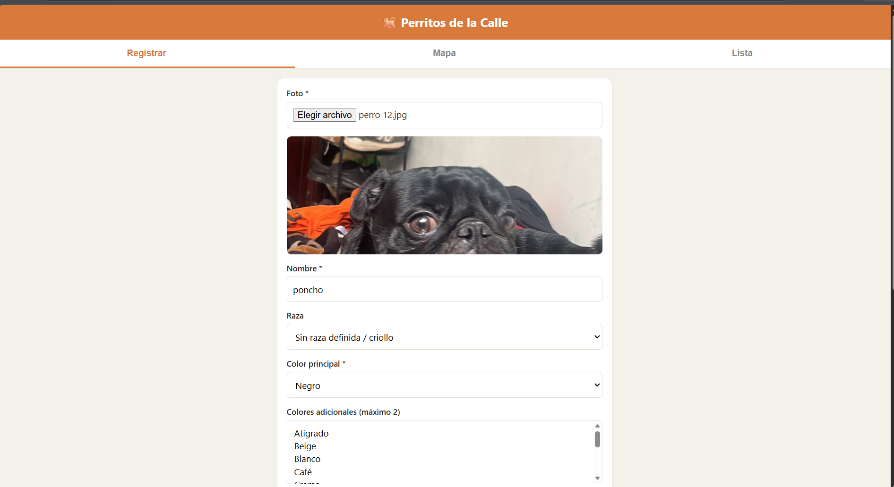
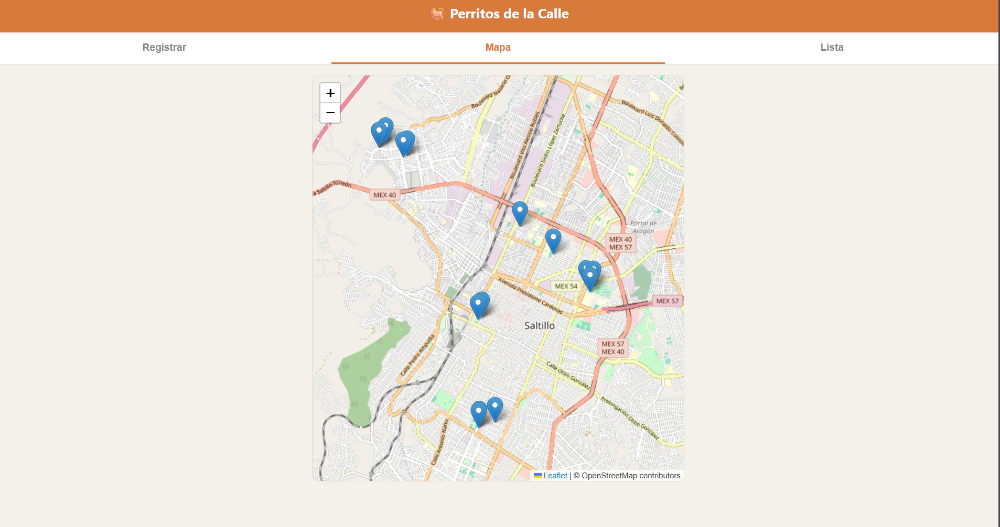
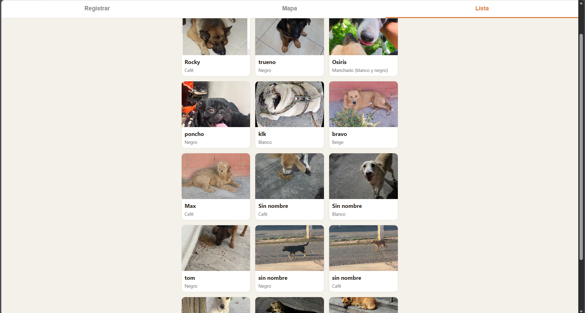
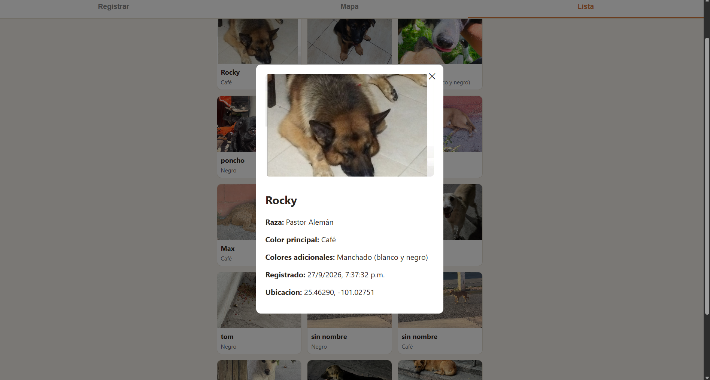

# Registro de Perritos de la Calle

Aplicación web para registrar perritos encontrados en la calle: foto, nombre, raza, colores y ubicación en un mapa, para que rescatistas, vecinos y asociaciones sepan qué perros hay, cómo identificarlos y en qué zona andan.

Está pensada para usarse tanto en **computadora** como en **celular**. Desde el celular, el campo de foto ofrece abrir la cámara; desde la computadora se sube un archivo de imagen existente. La prueba en un celular real está pendiente (ver la sección correspondiente).

## Integrantes del equipo

| Nombre | Rol |
|---|---|
| Diego Orlando Alonso Alvarado | Backend y DBA |
| Jose Uriel Coronado Jaramillo | Frontend |
| Oscar Osvaldo Berlanga Sierra | DBA |

## Qué hace la aplicación

- **Registrar** un perrito: foto (cámara o archivo JPG/PNG/WEBP), nombre, raza (opcional, de catálogo), color principal (obligatorio, de catálogo), 0 a 2 colores adicionales y ubicación (pin en el mapa: ubicación actual o movido a mano). La fecha la pone el sistema.
- **Mapa** con un pin por perrito; al tocarlo se ve su foto, nombre, raza y color.
- **Lista** de perritos con foto en miniatura.
- **Detalle** de cada perrito (al tocar su tarjeta).
- **Validaciones** en el frontend y en el backend, con mensajes entendibles (por ejemplo "Falta la foto").
- **Aviso de registro:** al guardar, un cuadro confirma "¡Perrito registrado!". Si el backend detecta que ese envío ya se había guardado, el cuadro dice "Este perrito ya estaba registrado". Si eliges la misma foto que ya registraste en la sesión, la app pide confirmación antes de enviar.

## Tecnologías y versiones exactas

- **Backend:** Node.js v20.20.1 + Express 4.19.2
- **Base de datos:** MySQL Community Server 8.0.45, instalado directo en Windows
- **Frontend:** HTML, CSS y JavaScript puro (sin frameworks) + Leaflet 1.9.4 con mapas de OpenStreetMap, cargados por CDN (sin API key)
- **Librerías del backend:** mysql2 ^3.11.0, multer ^1.4.5-lts.1, file-type ^16.5.4, uuid ^9.0.1, cors ^2.8.5, dotenv ^16.4.5, nodemon ^3.1.4 (desarrollo)

> Este proyecto **no usa Docker**. Todo se instala directo en la máquina.

## Requisitos previos

- [Node.js](https://nodejs.org/) v18 o superior (probado con v20.20.1)
- [MySQL Community Server](https://dev.mysql.com/downloads/mysql/) 8.0 o superior (probado con 8.0.45)
- [MySQL Workbench](https://dev.mysql.com/downloads/workbench/) (opcional, para administrar la base visualmente)
- Un navegador moderno (Chrome, Edge o Firefox)
- La extensión **Live Server** de VS Code (o cualquier servidor estático local) para el frontend
- Git

## Instalación paso a paso

### 1. Clonar el repositorio

```bash
git clone https://github.com/DiegoAlonso123-ai/Registro_perritos.git
cd Registro_perritos
```

### 2. Crear la base de datos

Con MySQL Server corriendo, ejecuta los scripts en orden. Estos comandos funcionan en PowerShell y en CMD, y te piden la contraseña de `root` cada vez:

```powershell
cmd /c "mysql -u root -p < database\schema.sql"
cmd /c "mysql -u root -p < database\seed.sql"
cmd /c "mysql -u root -p < database\seed-perritos.sql"
```

Esto crea la base `perritos_db` con sus 4 tablas, carga los catálogos (12 razas y 12 colores) y 15 perritos de prueba. El último script (`seed-perritos.sql`) es opcional: solo carga datos de ejemplo.

> Alternativa visual: en MySQL Workbench abre cada archivo (`database/schema.sql`, `database/seed.sql` y, si quieres los datos de prueba, `database/seed-perritos.sql`) y ejecútalo completo con `Ctrl+Shift+Enter`, en ese orden.

El diagrama entidad-relación está en `database/diagrama-entidad-relacion.png`.

### 3. Crear la carpeta de imágenes (fuera del proyecto)

Las fotos **no** se guardan dentro del repositorio. Se guardan en un directorio externo definido por la variable `RUTA_IMAGENES`:

```powershell
mkdir C:\perritos-imagenes
copy database\fotos-prueba\* C:\perritos-imagenes\
```

Las fotos de `database/fotos-prueba/` son las de los 15 perritos de prueba; al copiarlas a `RUTA_IMAGENES`, el backend puede mostrarlas. Si no cargas los datos de prueba, puedes omitir el `copy`.

### 4. Configurar el backend

```bash
cd backend
npm install
```

Copia `backend/.env.example` a `backend/.env` y ajusta tus valores:

```
DB_HOST=localhost
DB_PORT=3306
DB_USER=root
DB_PASSWORD=tu_contraseña_de_mysql
DB_NAME=perritos_db

RUTA_IMAGENES=C:\perritos-imagenes

PORT=3000
```

### 5. Correr el backend

```bash
npm run dev
```

Debes ver:

```
Conectado a MySQL correctamente.
Servidor backend corriendo en http://localhost:3000
```

El backend queda en **http://localhost:3000**.

### 6. Correr el frontend

Abre la carpeta del proyecto en VS Code, clic derecho sobre `frontend/index.html` y elige **Open with Live Server** (o el botón "Go Live" de abajo a la derecha). Queda en algo como **http://127.0.0.1:5500/frontend/index.html**.

> No abras `index.html` con doble clic: el navegador bloquea la cámara y la ubicación fuera de `http://localhost` o `https://`.

## Configuración (variables de entorno)

| Variable | Ejemplo | Descripción |
|---|---|---|
| `DB_HOST` | `localhost` | Host de MySQL |
| `DB_PORT` | `3306` | Puerto de MySQL |
| `DB_USER` | `root` | Usuario de MySQL |
| `DB_PASSWORD` | `tu_contraseña_de_mysql` | Contraseña de MySQL (nunca se sube a Git) |
| `DB_NAME` | `perritos_db` | Nombre de la base de datos |
| `RUTA_IMAGENES` | `C:\perritos-imagenes` | Carpeta fuera del proyecto donde se guardan las fotos |
| `PORT` | `3000` | Puerto del backend |

El archivo `.env` está en `.gitignore`. La plantilla sin contraseñas es `backend/.env.example`.

En el frontend, la URL del backend está en la primera línea de `frontend/app.js` (`API_URL`).

## Almacenamiento de imágenes

- Las fotos se guardan en disco, en la ruta `RUTA_IMAGENES`, **fuera** de cualquier carpeta del código o de despliegue.
- El backend **genera el nombre** del archivo (un UUID); nunca usa el nombre que mandó el usuario.
- El backend **valida el contenido real** del archivo (lee sus bytes con `file-type`), no solo la extensión. Solo acepta JPG, PNG y WEBP.
- Las imágenes se sirven por el endpoint `GET /api/imagenes/:nombre`; la carpeta nunca se expone directamente. El endpoint también protege contra rutas del tipo `../`.
- La carpeta `database/fotos-prueba/` del repositorio es solo material de instalación (fotos ligeras de los perritos de prueba). El backend nunca la sirve ni la usa.

## Probarlo desde un celular en la misma red

> **Pendiente:** esta prueba aún no se ha hecho en un celular real. Estos son los pasos previstos y se actualizarán cuando se compruebe.

1. Averigua la IP de tu computadora: en PowerShell, `ipconfig` y busca "Dirección IPv4".
2. En `frontend/app.js`, cambia temporalmente `API_URL` para que apunte a esa IP en vez de `localhost`.
3. Permite en el Firewall de Windows los puertos 3000 (backend) y 5500 (Live Server).
4. Con el celular en el mismo WiFi, abre la dirección del frontend usando esa IP.

**Nota:** el navegador solo da acceso a la ubicación (y a la cámara web) en `https` o `localhost`. Por eso, entrando por una IP con `http`, el botón "Usar mi ubicación actual" puede fallar; en ese caso se puede mover el pin a mano.

## Endpoints de la API

| Método | Ruta | Descripción |
|---|---|---|
| GET | `/api/razas` | Catálogo de razas |
| GET | `/api/colores` | Catálogo de colores |
| GET | `/api/perritos` | Lista de perritos (con `JOIN` a raza y color) |
| GET | `/api/perritos/:id` | Detalle de un perrito, con sus colores adicionales |
| POST | `/api/perritos` | Registra un perrito (`multipart/form-data`, con foto) |
| GET | `/api/perritos/estadisticas/colores` | Cuántos perritos hay por color (agregación) |
| GET | `/api/imagenes/:nombre` | Sirve una imagen guardada |

### Campos de `POST /api/perritos`

| Campo | Obligatorio | Regla |
|---|---|---|
| `foto` | Sí | Archivo JPG, PNG o WEBP (máx. 8 MB) |
| `nombre` | Sí | Texto no vacío; solo espacios no cuenta |
| `raza_id` | No | Id del catálogo de razas |
| `color_principal_id` | Sí | Id del catálogo de colores |
| `colores_adicionales` | No | Arreglo JSON de ids, por ejemplo `[2,5]`. Máximo 2, sin repetir entre sí ni repetir el principal |
| `ubicacion_lat`, `ubicacion_lng` | Sí | Coordenadas del pin |
| `idempotency_key` | Sí | Clave única del envío (ver sección de idempotencia) |

Respuestas de error en JSON con mensaje entendible, por ejemplo `{ "error": "Falta la foto" }`. La fecha de registro la pone el sistema.

## Capturas de pantalla

### Formulario de registro


### Mapa con los perritos registrados


### Lista de perritos


### Detalle de un perrito


## Estructura del repositorio

```
Registro_perritos/
├── backend/
│   ├── server.js            # arranque de la API y endpoint de imágenes
│   ├── db.js                # conexión a MySQL
│   ├── imagenes.js          # guardado y validación de fotos
│   ├── routes/
│   │   ├── perritos.js      # registro, lista, detalle, estadística
│   │   └── catalogos.js     # razas y colores
│   ├── .env.example
│   └── package.json
├── database/
│   ├── schema.sql           # creación de tablas
│   ├── seed.sql             # catálogos de razas y colores
│   ├── seed-perritos.sql    # 15 perritos de prueba
│   ├── fotos-prueba/        # fotos de los perritos de prueba
│   └── diagrama-entidad-relacion.png
├── frontend/
│   ├── index.html
│   ├── style.css
│   └── app.js
├── capturas/                # imágenes usadas en este README
└── README.md
```

## Flujo de trabajo con Git

- Un solo repositorio para el equipo.
- Se trabaja en ramas (`feature/...`, `docs/...`) y se fusiona a `main` mediante pull request revisado por otro integrante.
- Los mensajes de commit describen qué cambió.
- No se suben contraseñas (`.env`), `node_modules/` ni fotos pesadas; para eso está el `.gitignore`.

## Problemas comunes

- **"No se pudo conectar con el servidor" en el frontend:** verifica que el backend esté corriendo (`npm run dev` dentro de `backend/`) y que `API_URL` en `frontend/app.js` apunte a él.
- **El backend no conecta a MySQL:** confirma que el servicio `MySQL80` esté corriendo (busca "Servicios" en Windows) y que la contraseña en `.env` sea correcta.
- **Las razas y colores no cargan en el formulario:** falta correr `database/seed.sql`, o el backend no está corriendo.
- **Error "No database selected" al correr un script:** el script no trae la línea `USE perritos_db;` al inicio. Agrégala o ejecútalo desde MySQL Workbench con `perritos_db` como schema por defecto.
- **La cámara o la ubicación no funcionan:** abre el frontend con Live Server (`http://localhost` o `http://127.0.0.1`), no con doble clic. En el celular, la ubicación requiere `https`.
- **"El archivo no es una imagen valida":** el backend revisa el contenido real del archivo; sube un JPG, PNG o WEBP verdadero.
- **Error `ERR_PACKAGE_PATH_NOT_EXPORTED` con `file-type`:** se necesita la versión 16 (`"file-type": "^16.5.4"`); las versiones nuevas son solo ESM y no funcionan con `require`.
- **Puerto 3306 ocupado:** si hay otro MySQL corriendo, cambia `DB_PORT` en `.env` al puerto correcto.
- **Las fotos no se ven:** revisa que la carpeta de `RUTA_IMAGENES` exista y contenga los archivos que la base referencia (paso 3 de la instalación).

## Paradigmas usados en el proyecto

**Declarativo (SQL, HTML y CSS).** El filtrado, ordenamiento y agregación de datos se resuelven en SQL; el manejador de base de datos decide cómo ejecutarlos. En `backend/routes/perritos.js`:
- `GET /api/perritos` usa `JOIN` entre perritos, razas y colores, y `ORDER BY` para ordenar.
- `GET /api/perritos/estadisticas/colores` usa `JOIN`, `GROUP BY` y `COUNT(*)` para contar perritos por color.
- HTML y CSS también son declarativos: describen qué debe verse, no cómo dibujarlo.

**Imperativo.** Paso a paso, en `POST /api/perritos`: la cadena de validaciones con `if` y el ciclo `for` que inserta cada color adicional. En el frontend, el manejador del formulario en `app.js` valida, arma el `FormData`, envía y actualiza la interfaz.

**Funcional.** En `GET /api/perritos/:id` (`backend/routes/perritos.js`), las filas de colores adicionales se transforman con `map()`, sin mutar el resultado original y sin ciclos explícitos:

```javascript
const nombresColores = coloresAdicionales.map((fila) => fila.nombre);
```

En el frontend, `Array.from(...selectedOptions).map(...)` en `app.js` convierte las opciones elegidas en una lista de ids con el mismo estilo.

**Orientado a objetos.** El frontend usa Leaflet, que trabaja con instancias de objetos (`L.Map`, `L.Marker`) y sus métodos (`.bindPopup()`, `.on()`, `.setLatLng()`); el mapa se controla manipulando esos objetos.

## Idempotencia del registro

**Problema:** si el usuario presiona "Registrar" dos veces, o el celular reintenta la petición por mala señal, no debe quedar un perrito duplicado.

**Solución elegida:** una **clave de idempotencia por formulario**.
- El frontend genera `idempotency_key` con `crypto.randomUUID()` al cargar la página y la reutiliza en cada intento de envío. Solo genera una nueva después de un registro exitoso, para el siguiente perrito.
- En la base, `perritos.idempotency_key` es `UNIQUE`.
- Antes de insertar, el backend busca esa clave. Si ya existe, **no crea nada nuevo**: responde con el registro original (mismo `id`, mismos datos) y `"duplicado_evitado": true`.

**Por qué esta clave y no una natural:** nombre, foto o ubicación no identifican a un perrito de forma única (puede haber dos perros con el mismo nombre o en el mismo lugar), mientras que la clave por formulario identifica exactamente un intento de registro.

**Capas de protección en el frontend:** el botón "Registrar" se deshabilita mientras se envía; si la respuesta trae `duplicado_evitado`, se avisa "Este perrito ya estaba registrado"; y si se elige la misma foto que ya se registró en la sesión, se pide confirmación (aviso, no bloqueo, porque podrían ser perros distintos). La protección real contra duplicados por reintentos es la del backend.

**Prueba del doble envío (con Postman o similar):**
1. Envía `POST /api/perritos` (form-data) con `idempotency_key = demo-vivo` y todos los campos, incluida una foto.
2. Anota el `id` de la respuesta (201).
3. Envía **exactamente la misma petición** otra vez: responde con el **mismo `id`** y `duplicado_evitado: true`.
4. Verifica en la base que solo existe un registro:

```sql
SELECT COUNT(*) FROM perritos WHERE idempotency_key = 'demo-vivo';
-- resultado esperado: 1
```
**Prueba automática:** con el backend corriendo, desde la carpeta `backend`:

```powershell
npm run prueba:doble-envio
```

Envía dos veces el mismo registro (con la misma `idempotency_key`) y verifica que el segundo envío devuelve el mismo `id`, indica `duplicado_evitado` y no crea otro registro. Deja un perrito de prueba en la base; se borra con:

```sql
DELETE FROM perritos WHERE idempotency_key LIKE 'prueba-doble-envio-%' AND id > 0;
```